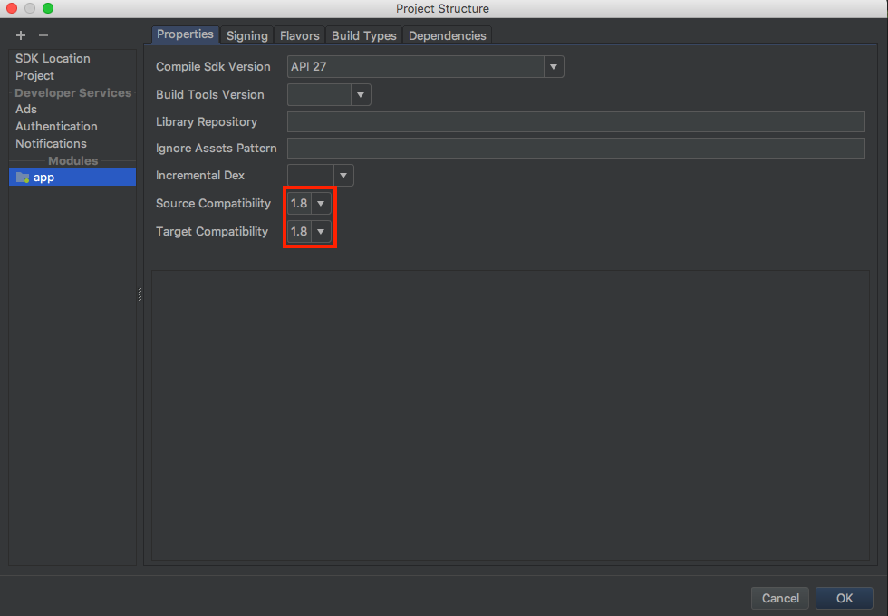

# Android - Getting Started

## 준비사항

* 안드로이드 개발 환경
* minSdkVersion 18 이상
* java 1.8 이상

## 프로젝트 생성 및 설정

### 프로젝트 생성 및 API 레벨 설정

API Level 18이상으로 설정 합니다.


### Compatibility 설정

Open Module Settings에서 Source Compatibility, Target Compatibility를 1.8 이상으로 설정해줍니다.



### Module Gradle 설정

build.gradle\(Module:app\) 의 dependencies에 아래와 같이 추가합니다.

```groovy
dependencies {
    /* RemoteMonster SDK */
    api 'com.remotemonster:sdk:2.4.14'
}
```

그 외에 multiDex 를 설정합니다.

```text
android {
    defaultConfig {
        ...
        multiDexEnabled true
    }
}
```

### Permission 설정

안드로이드 최신 버전의 경우 앱의 권한에 대해 처음 앱 사용시 사용자에게 직접 묻게 됩니다. 서비스에서 추가적으로 필요한 권한을 설정합니다. SDK 에서 디폴트로 필요로하는 권한은 다음과 같습니다.

```markup
<uses-permission android:name="android.permission.CAMERA" />
<uses-permission android:name="android.permission.CHANGE_NETWORK_STATE" />
<uses-permission android:name="android.permission.MODIFY_AUDIO_SETTINGS" />
<uses-permission android:name="android.permission.RECORD_AUDIO"/>
<uses-permission android:name="android.permission.INTERNET" />
<uses-permission android:name="android.permission.WRITE_EXTERNAL_STORAGE"/>
<uses-permission android:name="android.permission.ACCESS_NETWORK_STATE" />
<uses-permission android:name="android.permission.BLUETOOTH"/>
```

## 개발

이제 모든 준비가 끝났습니다. 아래를 통해 세부적인 개발 방법을 확인하세요.

### Service Key

SDK를 통해 RemoteMonster 방송, 통신 인프라에 접근하려면, Service Id와 Key가 필요합니다. 간단한 테스트와 데모를 위해서라면 이 과정을 넘어가도 좋습니다. 실제 서비스를 개발하고 운영하기 위해서는 아래를 참고하여 Service Id, Key를 발급 받아 적용하도록 합니다.



### 레이아웃 작업

방송과 통화 모두 음성전용이 아니라면 화면에 카메라 화면이나 상대편의 화면을 표시해야 합니다. Remon SDK에서는 이러한 화면을 담당하는 View가 별도로 있습니다. `SurfaceViewRenderer` 입니다. SurfaceViewRenderer를 layout.xml에 등록하고 해당 view를 Remon SDK에 지정해줘야 합니다.

즉, 다음과 같이 layout.xml에 Remon의 SurfaceViewRenderer를 등록합니다.


```markup
<RelativeLayout
android:layout_width="match_parent"
android:layout_height="match_parent"
android:background="@android:color/darker_gray"
android:layout_alignParentBottom="false"
android:layout_weight="2">
  <org.webrtc.SurfaceViewRenderer
    android:id="@+id/remote_video_view"
    android:layout_width="wrap_content"
    android:layout_height="wrap_content" />
  <org.webrtc.SurfaceViewRenderer
    android:id="@+id/local_video_view"
    android:layout_width="wrap_content"
    android:layout_height="wrap_content" />
</RelativeLayout>
```

위 예에서는 local 즉 자기 자신의 카메라영상을 출력하는 view와 remote 즉 상대방의 영상을 출력하는 view를 각각 등록하였습니다. 이제 필요한 작업이 모두 완료되었습니다. 위의 layout에 방송을 송출하거나 시청 혹은 통화를 시도하기 위한 버튼을 추가하면 기본적인 Remon SDK를 구동시켜볼 준비가 완료되었습니다.

### 방송

`RemonCast`로 방송 기능을 쉽고 빠르게 만들 수 있습니다.

#### 방송 송출

```java
caster = RemonCast.builder()
    .context(CastActivity.this)
    .localView(surfRendererlocal)        // 자신 Video Renderer
    .serviceId("SERVICEID1")    // RemoteMonster 사이트에서 등록했던 당신의 id를 입력하세요.
    .key("1234567890")    // RemoteMonster로부터 받은 당신의 key를 입력하세요.
    .build();
button.setOnClickListener{
    caster.create("CHANNEL_ID"); // 방송의 방 id와 함께 방송을 송출
}
```

버튼을 클릭하면 'CHANNEL\_ID'라는 이름의 방송 room이 만들어져서 당신은 방송을 즉시 할 수 있습니다. 당신의 방송을 시청하고 싶다면 다음 예제를 이용하여 개발을 하시거나 [웹용 Remon 샘플페이지](https://sample.remotemonster.com/castList.html)에서 당신의 방송을 시청해보세요.

#### 방송 시청

```java
viewer = RemonCast.builder()
    .context(ViewerActivity.this)
    .remoteView(surfRendererRemote)        // 방송자의 Video Renderer
    .serviceId("SERVICEID1")    // RemoteMonster 사이트에서 등록했던 당신의 id를 입력하세요.
    .key("1234567890")    // RemoteMonster로부터 받은 당신의 key를 입력하세요.
    .build();
button.setOnClickListener{
    viewer.join("CHANNEL_ID");              // 들어가고자 하는 channel
}
```

'CHANNEL\_ID'라는 이름의 방송을 시청합니다. 

#### 방송 목록 검색

시청의 경우 먼저 방송 목록을 가져와야 합니다. 때문에 다음과 같은 RemonCast의 메소드를 호출하여 방송 목록을 받아와야 합니다.

```text
remonCast = RemonCast.builder().context(ListActivity.this).build();
remonCast.fetchCasts();
remonCast.onFetch(casts -> {
    for (Channel cast : casts) {
        myChannelId = cast.getId;
    }
});

remonCast.join(myChannelId);
```

방송 서비스 개발을 위한 좀 더 자세한 내용은 아래를 참고하세요.



### 통화

`RemonCall`로 통화 기능을 쉽고 빠르게 만들 수 있습니다.

```java
remonCall = RemonCall.builder()
    .context(CallActivity.this)        
    .localView(surfRendererLocal)        //나의 Video Renderer
    .remoteView(surfRendererRemote)      //상대방 video Renderer
    .serviceId("SERVICEID1")    // RemoteMonster 사이트에서 등록했던 당신의 id를 입력하세요.
    .key("1234567890")    // RemoteMonster로부터 받은 당신의 key를 입력하세요.
    .build();
button.setOnClickListener{
    remonCall.connect("CHANNEL_ID")
}
```

버튼을 클릭하면 'CHANNEL\_ID'라는 이름의 통화용 방이 만들어집니다. [웹용 Remon 샘플 페이지](https://sample.remotemonster.com/callList.html)에서 당신이 만든 안드로이드 앱과 서로 통화를 해보세요.

#### 통화 목록 검색

만약 A라는 통화용 채널을 만들었는데 상대방은 어떻게 A라는 채널이 있는지 확인할 수 있을까요? 검색을 해야합니다. 다음과 같이 RemonCall의 메소드를 이용하여 채널을 검색하고 해당 채널에 들어갈 수 있습니다. 통화는 항상 2명만 참여할 수 있습니다.

```java
remonCall = RemonCall.builder().build();
remonCall.fetchCalls();
remonCall.onFetch(calls -> {
    for (Channel call : calls) {
        if (call.getStatus.equals("WAIT")) {   // Only WAIT channels
            myChannelId = call.getId;
        }
    }
});

remonCall.connect(myChannelId)
```

통화에 대하여 좀 더 자세한 내용은 아래를 참고하세요.



### 그 외 주요 메소드들

remonCall이나 remonCast로 수행할 수 있는 메소드는 크게 다음과 같습니다.

* close\(\) : 방송이나 통화를 종료할 때 사용합니다. 모든 자원이 사라집니다. close 후에 다시 RemonCall이나 RemonCast를 이용하여 방송/통화를 재개하고 싶다면 객체를 새롭게 생성하셔야 합니다.
* showLocalVideo\(\): 방송이나 통화 시작 전에 자신의 카메라 화면을 미리 보고 싶을때 호출합니다.
* pauseLocalVideo\(true\): 방송이나 통화 중 자신의 카메라 화면을 중지하고 싶을 때 호출합니다.
* switchCamera\(\): 모바일 플랫폼에서 가지고 있는 카메라를 순차적으로 스위칭해서 보여줍니다.
* fetchCalls, fetchCasts: 채널 검색을 위한 명령입니다.

### Callback에 대하여

다양한 이벤트를 받아서 처리할 수 있습니다. 이벤트 콜백은 방송, 통신에 따라 콜백의 종류가 다릅니다. 

* onInit\(\): 방송\(RemonCast\), 통화\(RemonCall\) 객체를 생성하면 인증절차등을 거쳐서 객체 생성이 마무리됩니다. 이렇게 잘 마무리되면 onInit메소드가 호출됩니다. 보통 onInit의 인자로 인증의 결과인 token값이 같이 전송됩니다. 
* onConnect\(\): 통화\(RemonCall\)를 위한 채널이 만들어졌을 때 발생합니다. 연결된 채널명\(채널ID\)가 전달되며, 동일한 채널에 접속한 사용자간 Peer 연결이 진행됩니다.
* onComplete : 통화\(RemonCall\) 를 위해 다른 사용자와의 Peer 연결이 완료된 이후 발생합니다.
* onCreate\(\): 방송\(RemonCast\) 을 온전히 송출하게 될 때 발생합니다. 인자값으로 방송룸의 ID가 반환됩니다.
* onJoin\(\): 방송\(RemonCast\) 시청이 온전히 이루어질 때 발생합니다.
* onClose\(\): 방송\(RemonCast\)과 통화\(RemonCall\)가 종료되었을 때 발생합니다. 인자값으로 CloseType이 전달됩니다.
* onError\(\): 에러가 발생하면 모두 이 onError로 오류 메시지가 전달됩니다. 
* onStat\(\): 현재 방송, 통화 품질을 3초마다 주기로 알려줍니다.

콜백에 대해 세부 내용 알고싶으시면 아래 내용을 참고하세요.



