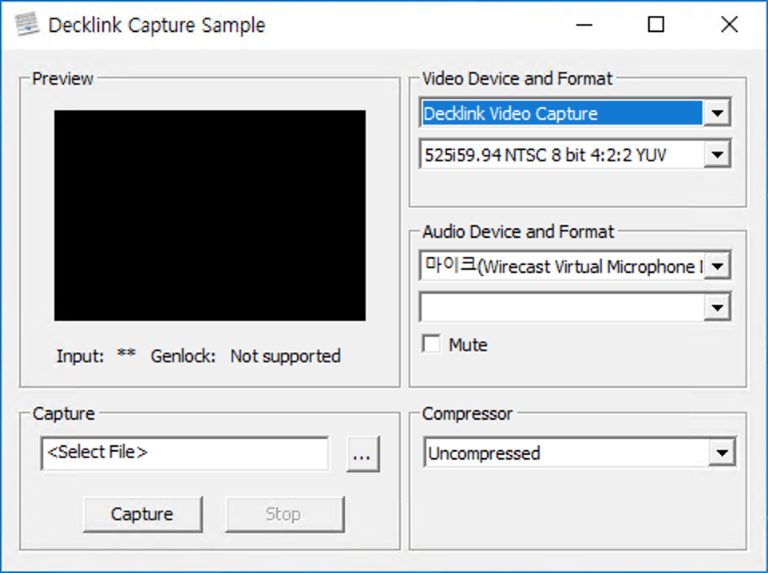

# Livecast - Studio environment

방송을 송출시 스튜디오 구성에 대한 안내입니다. 일반적으로 모바일이나, 간단하게 카메라가 있는 노트북을 통해 방송 송출이 가능하지만, 경우에 따라서 1인 방송환경이나, 전문 스튜디오 환경에서 방송송출이 필요할 수 있습니다. 이런 환경에서 방송시 아래와 같은 구성을 할 수 있습니다.

방송을 기준으로 설명되어 있으며, 같은과정을 통해 통신환경에서도 사용할 수 있습니다.

## 1인 방송 환경

기본적인 노트북, PC에서 추가적인 카메라와 마이크 등을 통해 방송을 송출하고자 할 때 입니다.

노트북, PC에서 간단하게 웹캠을 추가하여 방송할 수 있습니다. 보통 최적의 방송 품질을 위해 아래와 같은 4K지원의 웹캠을 사용합니다.



웹캠이 아니더라도 UVC\(USB Video Class\) 규격을 지원하는 모든 비디오 장치는 별도의 과정없이 곧바로 브라우저에서 해당 장비를 선택하여 방송을 송출하거나 통신에 사용이 가능합니다.

소지하고 있는 장비가 UVC를 지원하는지 확인하려면 Skype를 통해 지원 여부와 정상작동여부를 확인 가능합니다. 설정 &gt; Audio / Video 에서 기기 선택이 가능하면 UVC를 지원하는 장치 입니다. 



UVC에 대한 자세한 내용은 아래를 참고하세요.





## 스튜디오 환경

별도의 외부 카메라와 전문 장비가 갖추어진 스튜디오 환경 안내 입니다. 실질적으로는 UVC가 지원되지 않는 DSLR, Video Camera 사용에 관한 안내입니다. 아래의 문서에서 브라우저에서 장치선택, 미디어의 브라우저 입력에 관한 부분은 설정에 관련된 개발이 일부 필요할 수 있으며 해당내용은 이문서의 개발을 확인하세요.

### 구성

기본적으로 외부카메라와 외부카메라를 연결하는 케이블, 케이블을 통해 신호를 입력받는 캡쳐보드로 구성됩니다.

이 때, 케이블 혹은 입출력 규격에 따라 크게 HDMI와 SDI를 고려하여 구성을 할 수 있습니다. HDMI의 경우 대중적으로 많이 사용되는 규격으로 대다수의 카메라가 지원하며, SDI의 경우는 보다 전문적인 장비에 주로 탑제되어 사용됩니다.

{% embed url="https://ko.wikipedia.org/wiki/%EA%B3%A0%EC%84%A0%EB%AA%85\_%EB%A9%80%ED%8B%B0%EB%AF%B8%EB%94%94%EC%96%B4\_%EC%9D%B8%ED%84%B0%ED%8E%98%EC%9D%B4%EC%8A%A4" %}

{% embed url="https://ko.wikipedia.org/wiki/%EC%8B%9C%EB%A6%AC%EC%96%BC\_%EB%94%94%EC%A7%80%ED%84%B8\_%EC%9D%B8%ED%84%B0%ED%8E%98%EC%9D%B4%EC%8A%A4" %}

캡쳐보드, 캡쳐 인터페이스는 이러한 입력 신호를 수신할 수 있는 장비를 선택하면 됩니다. 리모트몬스터는 아래와 같은 장비를 테스트 하였으며 정상 작동을 확인하였습니다.

### Windows - Blackmagic DeckLink



윈도우에서는 PCI-e인터페이스를 사용하는 캡쳐보드나 USB-C규격을 사용하는 외부 캡쳐 장비를 사용할 수 있습니다. 그중에서 동작을 확인한 덱링크 캡쳐보드를 통해 카메라 입력신호를 받는 방법을 안내합니다. 덱링크에서 카메라 입력시 브라우저에서는 보통 2개의 장비가 보이게 됩니다. 이 중 Decklink Video Capture를 선택하고 정확한 해상도와 FPS를 RemoteMonster Web SDK Config를 통해 입력해야 합니다.

정확한 입력이 되었음에도 불구하고 경우에 따라서 카메라의 설정이 브라우저가 지원하지 않는 범위 어서 화면이 정상적으로 표출 되지 않을 수 있습니다. 이를 해결하기 위해 아래의 단계를 거칩니다.

간단하게는 크롬 브라우저의 주소입력에서 chrome://media-internals/ 를 입력하여 현재 브라우저가 인식할 수 있는 장치와 해상도, FPS를 확인가능합니다.



Blackmagic 장비의 경우 홈페이지에서 최신 Desktop Video와 Desktop Video SDK를 설치하고 보다 세부적인 정보를 아래와 같은 방법으로 알 수 있습니다.



Desktop Video SDK를 받아 압축을 해제하고 다음 파일을 실행합니다.

```text
Win/DirectShow/Samples/bin/DecklinkCapture.exe
```



프로그램의 Video Device and Format에서 Decklink Video Capture를 선택한후 아래에 나오는  해상도, FPS가 브라우저가 입력받을 수 있는 값입니다. 이 값중 원하는 값으로 카메라를 설정하고 Blackmagic Desktop Video Setup를 실행하여 카메라에서 설정된 값이 입력되고 있는지 확인합니다. 정상적으로 카메라 입력신호를 받고있다면 DecklinkCapture프로그램에서 해상도와 FPS를 설정하면 Preview화면에 비디오가 보일것 입니다.

그 후 브라우저와 RemoteMonster Web SDK의 config를 통해 정확한 해상도와 FPS를 입력하면 정상적으로 미디어가 브라우저를 통해 전송될 것 입니다. 이때 카메라를 사용하고 있는 DecklinkCapture를 종료시켜야 브라우저가 정상적으로 카메라 자원을 얻을 수 있습니다. 캡쳐보드 자원은 한번에 한 프로그램만 사용 가능합니다.



기타 장비로도 위와같이 윈도우의 Direct Show 구성을 확인하여 브라우저에서 미디어를 얻을 수 있으나, 일부 저렴한 장비에서는 720P, 30FPS 이상의 고품질 환경에서 화면 끊김등이나 카메라, 캡쳐 보드간 화면 끊김이 확인되고 있음을 참고하여 다른 캡쳐 장비를 선택 가능합니다.

### MacOS - Blackmagic UltraStudio



맥에서는 Thunderbolt 3입력을 지원하는 외부 캡쳐 장치를 사용하여 외부 전문 카메라를 입력받아 방송에 사용 할 수 있습니다. 그중에서 동작을 확인한 울트라 스튜디오를 통해 카메라 입력신호를 받는 방법을 안내합니다.  울트라스튜디오에서 카메라 입력시 브라우저에서는 매우 많은 의 장비가 보이게 됩니다. 이 중 실제로 입력받고 있는 정확한 해상도와 FPS의 장비를 선택한 후 RemoteMonster Web SDK Config를 통해 같은 값을 정확히 입력해야 합니다.

### 기타

위의 장비가 아닌 다른 장비의 경우 소프트웨어적인 방법으로 브라우저로 미디어를 전송할 수 있습니다. 일반적으로 Virtual WebCam이라는 형태로 아래의 프로그램을 통해 송출 가능합니다.

#### OBS + OBS VirtualCam Plugin - Windows





윈도우에서만 가능하며 화상은 OBS와 플러그인을 통해 브라우저로 입력하고, 소리는 곧장 캡쳐보드에서 브라우저로 입력합니다. 이 구성은 장치의 환경에 따라서 소리와 화면간 동기가 안맞을 수 있으니 주의해서 사용해야 합니다.

#### Wirecast - Windows/MacOS



윈도우와 맥에서 사용가능합니다. 와이어케스트의 가상카메라 기능을 통해 브라우저로 화면과 소리를 동시에 송출 할 수 있습니다. 아래를 참고하여 설정 가능합니다.



## 개발

장비를 선택하거나 FPS, 해상도를 정확히 입력하는 작업이 필요합니다. 이 작업은 웹표준에서 지원하는 방식을 그대로 사용하며 아래는 간략하게 소개입니다.





### 장치를 열거하고 장치 ID 확인하기

브라우저가 인식할 수 있는 장치를 열거하고 장치의 ID를 얻어올 수 있습니다. 이때 지금 페이지에서 브라우저가 사용자에게 권한을 얻어오면 사용자가 선택하기 쉽도록 라벨명도 얻어올 수 있습니다.

```javascript
async function getDevices() {
  try {
    // NOTE: 퍼미션 없으면 기기의 ID만 받아옴. 라벨명을 받으려면 퍼미션 필요
    // Promise.all([
    //  navigator.permission.query({ name: 'camera'}),
    //  navigator.permission.query({ name: 'microphone'})
    // ])

    // NOTE: getUserMedia로도 permission 얻을 수 있음
    const mediaStream = await navigator.mediaDevices.getUserMedia({ video: true, audio: true })
    const userDevices = await navigator.mediaDevices.enumerateDevices()
    mediaStream.getTracks().forEach(track => track.stop()) // getUserMedia 때문에 자원을 반환해야함
    return userDevices
  } catch (err) {
    console.error(err)
  }
}

const devices = await getDevices()
```





### 해당장치가 제공되는 기능 확인하기

획득한 장치 ID를 갖고 해당장치의 기능을 미리 확인 가능합니다. 이때도 마찬가지로 권한이 있어야 합니다. 아래와 같이 ID와 장치 type을 통해 기능을 확인 가능합니다. 얻을 수 있는 정보는 아래의 링크를 확인하세요.

```javascript
async function getDeviceCapabilities(kind, deviceId) {
  const videoConstraints = {
    audio: false,
    video: {
      deviceId: deviceId ? { exact: deviceId } : undefined
    }
  }
  const audioConstraints = {
    audio: {
      deviceId: deviceId ? { exact: deviceId } : undefined
    },
    video: false
  }
  const constraints = !kind ? undefined :
    kind === 'audioinput' ? audioConstraints :
    kind === 'videoinput' ? videoConstraints :
    new Error('getDeviceCapabilities/unexpected_args', kind)

  try {
    if (constraints instanceof Error) return
    const mediaStream = await navigator.mediaDevices.getUserMedia(constraints)
    const capabilities = mediaStream.getTracks().map(track => track.getCapabilities())
    mediaStream.getTracks().forEach(track => track.stop())
    return capabilities
  } catch (err) {
    console.error('getDeviceCapabilities/getUserMedia', err)
  }
}

const capabilities = await Promise.all(devices.map(d => getCapabilities(d.kind, d.deviceId))) 
```



### 특정 장치와 장치 설정값으로 방송만들기

Web SDK의 Config를 사용해 특정장치와 정확한 값을 입력하고 방송을 만들 수 있습니다. 세부적인 내용은 아래를 참고하세요.

```javascript
const config = {
  media: {
    video: {
      deviceId: { exact: __DEVICE_ID__ },
      width: { exact: __WIDTH__ },
      height: { exact: __HEIGHT__ },
      frameRate: { exact: __FRAME_RATE__ }
    }
  }
}

const remon = new Remon({ config })
```



### 만들어진 미디어에 대한 설정값 확인하기

만들어진 미디어에 대해 지정된 설정값이 반영되었는지를 확인할 수 있습니다.

```javascript
const settings = remon.cofig.rtc.localStream.getTracks().map(track => track.getSettings())
```

