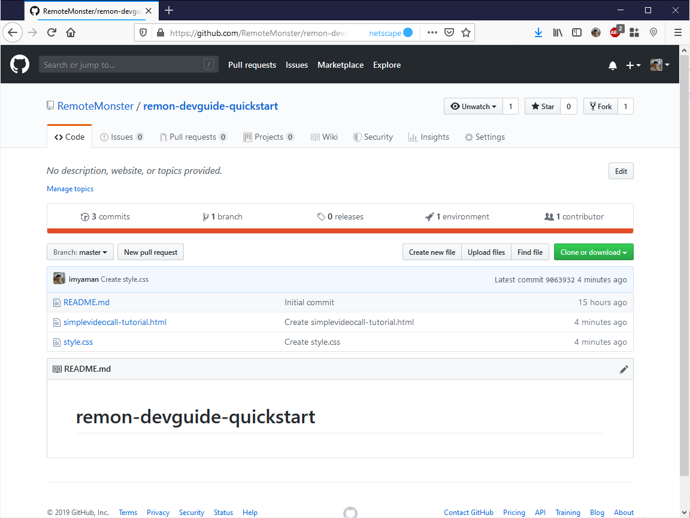
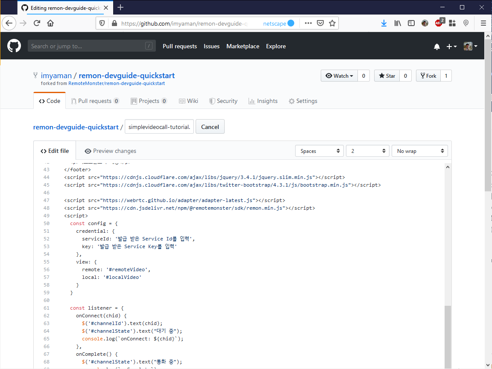

# 통화 5 분 안에 시작하기

"5분 안에 시작하기"로 통화를 빨리 체험봅니다. 5분 안에 시작하기는 다음의 내용으로 이루어져있습니다.

1. **Service ID와 Secret Key 확인**
2. **샘플 앱으로 통화 실시**
3. **웹 콘솔에서 이 통화에 대한 정보 조회**

## 준비 사항

* 웹 콘솔 회원 가입 : [https://console.remotemonster.com/](https://console.remotemonster.com/)
* GitHub 계정 또는 HTTPS가 지원되는 웹 호스팅 

## Service ID와 Secret Key 확인

리모트몬스터 콘솔을 방문하여 회원가입을 하고 "기본 프로젝트"를 선택합니다. Service ID와 Secret Key\(Service Key\)를 확인합니다. 이 Service ID와 Secret Key를 샘플 앱의 코드에 삽입합니다. Secret Key를 보려면 우측 **눈 아이콘**을 클릭합니다.

[https://console.remotemonster.com/](https://console.remotemonster.com/)

주의 : Secret Key는 \*\*\*\*\*\*\*\*\*\*\*\*\*\* 이 아닙니다. 우측 눈 아이콘을 누르면 표시됩니다.


## **샘플 앱으로 통화 실시**

아래 GitHub 웹 사이트를 방문합니다.



아래와 같은 모습이 보입니다. simplevideocall-tutorial.html 파일을 웹에 게시할 겁니다. 본 가이드는 GitHub Pages를 이용합니다. https가 지원되는 환경이라면 다른 곳에 파일을 게시해도 좋습니다.



우측 상단의 Fork 버튼을 클릭합니다. 내 저장소가 생겼습니다. 내 저장소의 주소는 아래와 같습니다.

```text
https://github.com/내 아이디/remon-devguide-quickstart
```

저장소의 HTML 파일들을 웹에서 볼 수 있도록 설정합니다. "Settings" 탭으로 이동합니다. 페이지 아래에 "GitHub Pages" 섹션으로 이동하여, Source를 master branch로 선택합니다.


HTML 파일을 아래 주소에서 확인할 수 있습니다. 아래와 같은 화면이 표시됩니다.

```text
https://내 아이디.github.io/remon-devguide-quickstart/simplevideocall-tutorial.html
```


접속이 잘 되는 것을 확인했으면, 앱에 Service ID와 Secret Key를 입력합니다. 내 저장소로 이동하여 simplevideocall-tutorial.html 파일을 클릭합니다. 아래와 같은 화면이 표시됩니다. 오른쪽 편집 아이콘\(연필 모양\)을 클릭합니다.


콘솔에서 확인한 Service ID와 Secret Key\(Service Key\)를 52번 행에 입력합니다. "Commit changes" 버튼을 눌러 저장합니다.



서로 다른 디바이스\(예, 노트북과 스마트폰\)에서 웹 브라우저를 열고 아래 주소를 각각의 창에서 방문합니다.

```text
https://내 아이디.github.io/remon-devguide-quickstart/simplevideocall-tutorial.html
```

두 창에서 "시작" 버튼을 클릭합니다. Camera와 Microphone 사용을 **반드시** 허락\(Allow\)합니다.


잘 안 되신다면 아래 3가지를 먼저 확인해보시기 바랍니다.

* https 가 아니고 http로 접속하지 않았나?  
* 카메라, 마이크 접근 권한을 허용하지 않았나?  
* 내 저장소의 주소가 아니라 리모트몬스터 저장소의 주소에 접속하지 않았나?

## 웹 콘솔에서 이 통화에 대한 정보 조회

콘솔 창에서, "통화플랫폼 &gt; 채널 및 세션" 메뉴로 이동합니다. 방금 만든 통화에 대한 정보를 조회할 수 있습니다.


**축하합니다. 통화플랫폼이 정상적을 동작하는 것을 확인하였습니다.**

튜토리얼의 새 프로젝트 설정, 단순 통화 앱 만들기 등을 참고하여, 통화 앱을 원하는 대로 만들어보십시오.

