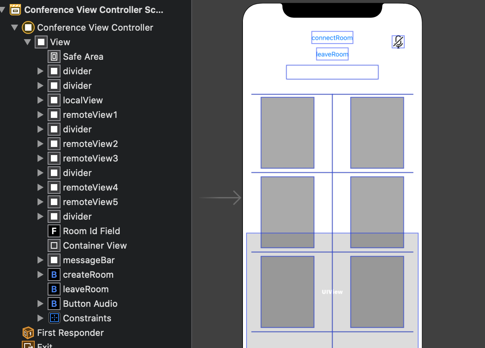
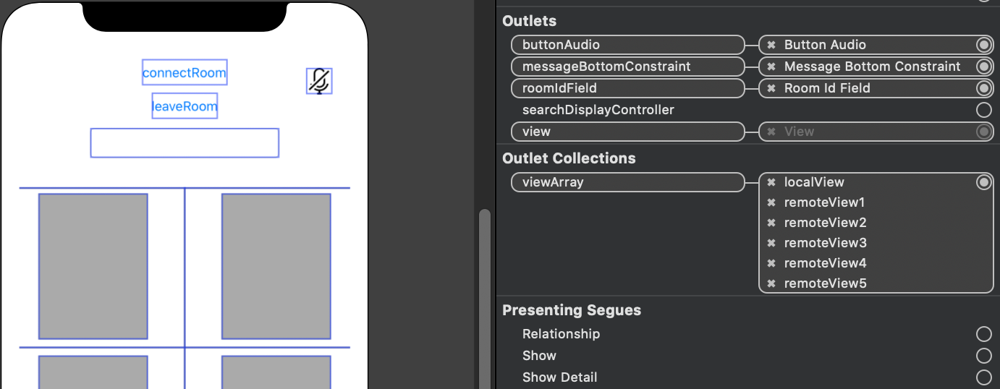

# 그룹통화 만들기\(iOS\)

## 그룹통화란?

다수의 참여자가 통화에 참여하는 서비스를 위한 기능입니다. 참여자는 앱을 이용하는 나와 그 외 참여자로 구분할 수 있습니다. 아래에서는 나와 참여자로 줄여서 표시합니다. 한 회기의 그룹통화는 RemonConference 클래스의 인스턴스로 대표됩니다. 나는 통화 연결, 참여자들의 입장/퇴장 알림 등 대부분의 일을 RemonConference 객체에게 위임합니다.

## RemonConference

그룹통화를 위해 RemonConference 객체를 생성하고, 설정을 진행합니다.

RemonConference 클래스는 그룹통화를 위해 아래 메소드를 제공합니다.

```swift
create( callback:OnInitializedCallback )
join( roomName:String )
leave()
getClient( index:Int )
```

RemonConference 클래스는 콜백으로 사용하기 위해 아래 메소드를 제공합니다. 이하 콜백용 메소드라고 합니다. 콜백용 메소드는 위에서 언급한 메소드의 콜백으로만 호출하며, 일반적인 메소드처럼 호출하지 않습니다.

```kotlin
// create 메소드의 콜백용 메소드
.then { channelName in
}.close {
}.error { error in
}

// join 메소드의 콜백용 메소드 
.on { channelName, index, participant ->
}

// on 메소드의 콜백용 메소드
.then { channelName in
}.close {
}.error { error 
}
```

## 레이아웃 작업

그룹통화 화면을 나의 영상 한 개와 그룹 참여자의 영상 여러 개로 구성합니다. 레이아웃에 영상을 표시할 view를 만들고 인덱스를 지정하여 참여자의 영상을 원하는 위치에 표시할 수 있도록 합니다.



## 레이아웃 초기화

레이아웃을 바인딩하고, 각 view를 배열에 담아 index 로 접근이 가능하도록 설정합니다.

```swift
@IBOutlet var viewArray: [UIView]!
```



## RemonConference 객체 생성

RemonConference 객체를 생성하고, 나의 영상을 송출하기 위한 설정을 합니다.

```kotlin
var remonConference = RemonConference()

remonConference.create { participant in
    // 마스터유저가 전달됩니다. (iOS의 경우 Builder 를 제공하지 않습니다)
    // 객체 생성은 RemonConference에서 이루어지므로 전달된 객체에 설정만을 제공합니다.
    participant.serviceId( "콘솔을 통해 발급 받은 Service Id" )
    participant.key( "콘솔을 통해 발급 받은 Secret Key" )
    participant.localView( surfaceRendererArray[0] )
}.then { channelName in
    // 그룹통화에 참여하면 호출됩니다.
    // 마스터 유저가 송출하는 채널명이 전달됩니다.
    print( "MasterChannel : \(channelName)" )
}.close {
    // 마스터 유저가 연결된 채널이 종료되면 호출됩니다.
}.error { error
    // 마스터 유저가 연결된 채널에서 에러 발생 시 호출됩니다.
}
```

## 그룹통화 참여

join 메소드로 그룹통화에 입장합니다. join 메소드에게 그룹통화 이름을 인자로 전달합니다. 첫번째 참여자가 입장할 때 이 이름의 그룹통화가 생성됩니다. 모든 참여자가 퇴장하면 이 이름의 그룹통화는 소멸됩니다.  
join 명령으로 그룹통화에 입장합니다. 새 참여자가 그룹통화에 입장하면 연결된 on 메소드의 콜백이 호출됩니다. on 메소드 콜백에서 인덱스와 참여자와 연결을 위한 builder가 제공되므로, 해당 정보를 사용해 설정을 진행합니다. 해당 참여자와 연결이 이루어지고 나면 then, close, error 콜백을 통해 상태가 전달되므로 해당 콜백 메소드에서 UI 변경 작업을 진행할 수 있습니다.

```kotlin
remonConference.join( "그룹통화 이름" ).on { channelName, index, participant ->
    Log.d( TAG, "Joined new user" )
    // 그룹통화에 새로운 참여자가 입장했을 때 호출됩니다.
    // 새로운 참여자의 채널명과 index, RemonParticipant 객체가 전달됩니다.
    // Service ID, Secret Key는 마스터 유저의 정보를 사용하므로 추가로 입력할 필요는 없습니다.
    // index는 0번은 마스터 인덱스 이므로, 1번 부터 시작합니다.
    participant.remoteView( surfaceRendererArray[index] )
}.then {
    // 새 참여자와 연결되면 호출됩니다.
}.close {
    // 상방이 컨퍼런스에서 떠난 경우 or 연결이 종료된 경우 호출됩니다.
}.error {
    // 상대방과의 연결된 채널에서 에러 발생 시 호출됩니다.
}
```

## 그룹통화 종료

그룹통화에서 퇴장하면 나와 그룹통화의 연결이 종료됩니다. 나와 참여자들 간의 연결도 종료됩니다.

```swift
remonConference.leave()
```

## RemonParticipant

각 참여자들과의 연결은 RemonConference 내부의 RemonParticipant 객체를 통해 이루어집니다. RemonParticipant 객체는 RemonClient를 상속받은 객체이므로, 공통적인 기능은 RemonCall, RemonCast 와 동일합니다.  
만약 해당 객체를 얻을 필요가 있는 경우 인덱스를 사용해 RemonParticipant 객체를 얻어올 수 있습니다.  
index = 0 번은 마스터 유저\(자신\)이며, 나머지 인덱스는 join.on 콜백에서 전달된 index 번호를 사용합니다. 해당 사용자가 없는 경우 nil 이 반환됩니다.

```kotlin
// 마스터 유저 얻기
var participant:RemonParticipant = remonConference.getClient(0)

// 다른 사용자 얻기
var participant:RemonParticipant = remonConference.getClient(1)
```


RemonParticipant 객체는 RemonClient를 상속받은 객체입니다. onCreate, onClose, onError 콜백은 then,close,error로 재정의되어 RemonConference에서 관리, 사용되고 있으므로, 해당 콜백을 변경하지 마시기 바랍니다.


