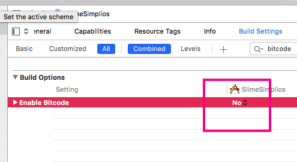
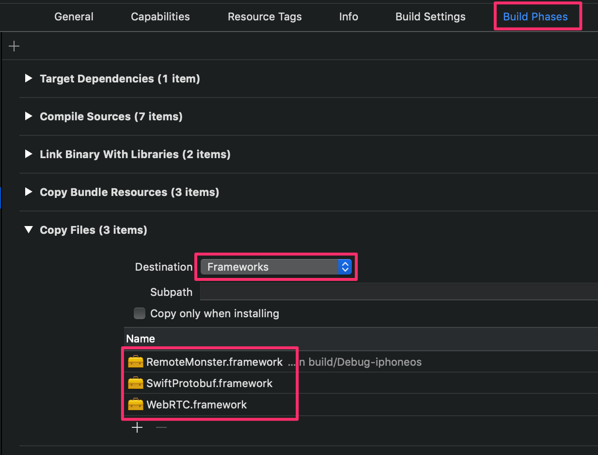
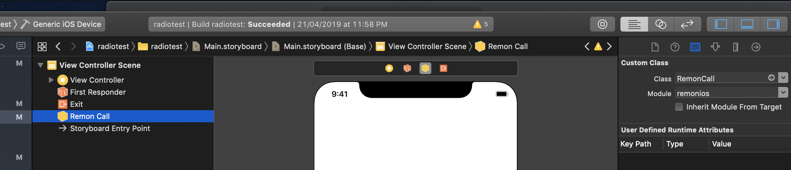
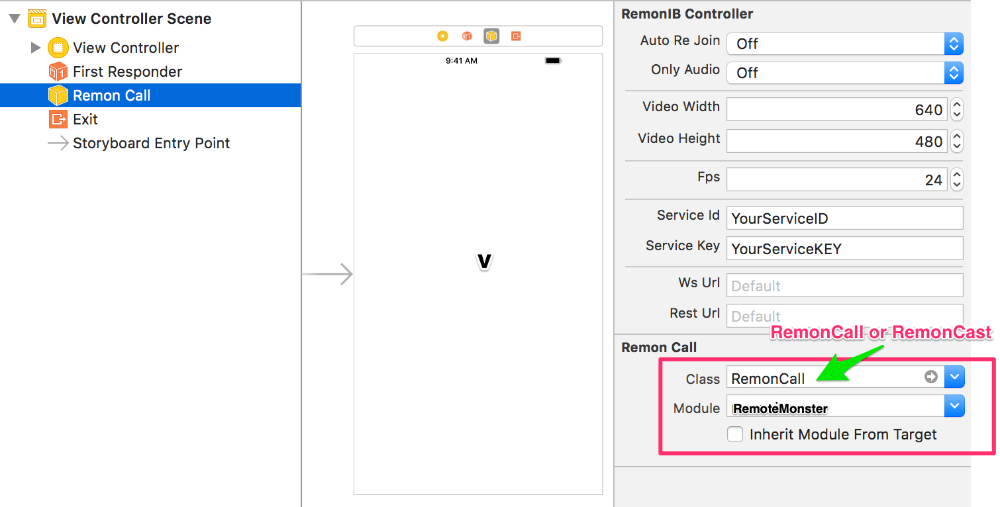
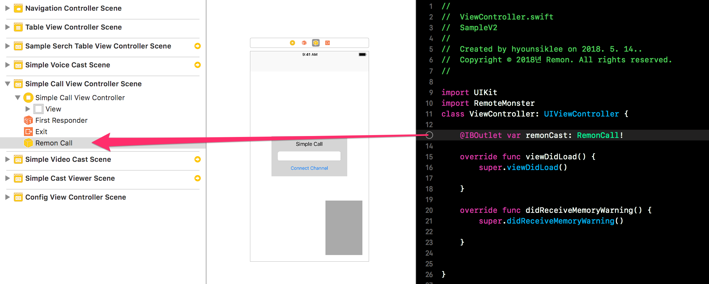

# iOS - Getting Started

## 준비 사항

* Xcode 개발 환경
* iOS 10.0 이상

## 프로젝트 생성 및 설정

Xcode에서 Swift기반의 프로젝트를 생성합니다.

프로젝트 생성 후 `Build Settings`에서 `Enable Bitcode`에 대하여 `No`를 설정해야 합니다.



Objc 환경이라면 ALWAYS\_EMBED\_SWIFT\_STANDARD\_LIBRARIES 값을 Yes로 설정해야 합니다.


또한 Info.plist에서 다음 항목에 대해 추가 혹은 변경을 해주셔야 합니다.

* Privacy: Bluetooth, Microphone, Camera


## SDK 설치 - Cocoapods

SDK 설치를 원하는 프로젝트의 `Podfile`에 `pod 'RemoteMonster', '~> 2.6.11'`을 추가 합니다


```text
target 'MyApp' do
  # Comment the next line if you're not using Swift and don't want to use dynamic frameworks
  use_frameworks!
  pod 'RemoteMonster', '~> 2.6.11'
end
```


. 그리고 터미널에서 `pod install` 를 실행 합니다. 만약 `pod install` 이 동작하지 않는 다면 `pod update`를 실행 합니다.

```bash
$ pod install
```


업데이트가 정상적으로 이루어지지 않는 경우 cocoapods의 로컬 저장소를 먼저 업데이트 후 사용해 보시기 바랍니다.

```text
$ pod repo update
$ pod update
```

## SDK 설치 - 직접 import

우선 아래의 링크를 통해 iOS SDK의 마지막 버전을 다운로드 받습니다.



다운로드받은 RemoteMonster iOS SDK를 폴더에는 3개의 관련 Framework이 존재합니다. 각각의 Framework을 Finder에서 끌어다 프로젝트 트리창에 놓습니다. 그러면 RemoteMonster SDK를 프레임워크로 인식하게 됩니다.


Build Phases에 copy file 항목을 추가 하고, 위 단계에서 추가한 Frameworks를 복사 대상으로 추가 하여 줍니다.



## Remon 설정 및 레이아웃 구성

### 인터페이스빌

RemonCast, RemonCall 객체는 `RemonClient(sdk 2.6.9 이하 버전은 RemonIBController)` 를 상속받은 객체이며,  RemonClient는 InterfaceBuilder를 이용한 설정이 가능하도록 구성되어 있습니다. 

* 스토리보드에 `RemonClient`의 하위객체인 `RemonCall` 또는 `RemonCast`를 추가합니다.
  * `RemonCall`를 1:1 통신을 지원 하며 `RemonCast`는 1:N 방송을 지원 합니다.
  * xcode의 한계상 직접 RemonCall이나 RemonCast를 삽입이 불가능합니다. 따라서 RemonCall이나 RemonCast 객체를 Designer에 삽입할 수 없으므로 Library에서 Object 컴포넌트로 먼저 삽입후 해당 Object의 class를 아래 그림과 같이 직접 수정해 주세요. module은 RemoteMonster로 설정하시면 됩니다. 
  * InterfaceBuilder에서 `Utilities` 뷰를 이용하여 `RemonCall`을 설정 합니다.
* `ServiceID`와 `Service Key`를 설정합니다.
  * 만약 간단하게 테스트를 하기 원한다면 아무것도 입력 안해도 됩니다.
  * 실제 서비스를 고려한다면 아래를 참고하여 내가 사용할 키를 발급받으세요.





* 스토리보드에서 원하는 Scene에서 원하는 위치에 `Veiw`를 배치하고 `RemonClient(sdk 2.6.9 이하는 RemonIBController)`의 `remoteView`와 `localView`에 바인딩 하여 줍니다.


* `Remon`를 사용하는 `ViewContoller`에 RemoteMonster SDK를 임포트 하고, `RemonClient(sdk 2.6.9 이하는 RemonIBController)`객체를 아웃렛 변수에 바인딩 합니다.




### 코드에서 직접 구현


## 개발

이제 모든 준비가 끝났습니다. 아래를 통해 세부적인 개발 방법을 확인하세요.

### 방송

`RemonCast`로 방송 기능을 쉽고 빠르게 만들 수 있습니다.

#### 방송 송출

```swift
let caster = RemonCast()
caster.create()
```

#### 방송 시청

```swift
let viewer = RemonCast()
viewer.join("CHANNEL_ID")
```

혹은 좀더 자세한 내용은 아래를 참고하세요.



### 통신

`RemonCall`로 통신 기능을 쉽고 빠르게 만들 수 있습니다.

```swift
let remonCall = RemonCall()
remonCall.connect("CHANNEL_ID")            // Communication
```

혹은 좀더 자세한 내용은 아래를 참고하세요.




### 그 외 주요 메소드들

remonCall이나 remonCast로 수행할 수 있는 메소드는 크게 다음과 같습니다.

* close\(\) : 방송이나 통화를 종료할 때 사용합니다. 모든 자원이 사라집니다. close 후에 다시 RemonCall이나 RemonCast를 이용하여 방송/통화를 재개하고 싶다면 객체를 새롭게 생성하셔야 합니다.
* showLocalVideo\(\): 방송이나 통화 시작 전에 자신의 카메라 화면을 미리 보고 싶을때 호출합니다.
* pauseLocalVideo\(true\): 방송이나 통화 중 자신의 카메라 화면을 중지하고 싶을 때 호출합니다.
* switchCamera\(\): 모바일 플랫폼에서 가지고 있는 카메라를 순차적으로 스위칭해서 보여줍니다.
* fetchCalls, fetchCasts: 채널 검색을 위한 명령입니다.

### Callback에 대하여

다양한 이벤트를 받아서 처리할 수 있습니다.

* onInit\(\): 방송\(RemonCast\), 통화\(RemonCall\) 객체를 생성하면 인증절차등을 거쳐서 객체 생성이 마무리됩니다. 이렇게 잘 마무리되면 onInit메소드가 호출됩니다. 보통 onInit의 인자로 인증의 결과인 token값이 같이 전송됩니다.
* onConnect\(\): 통화\(RemonCall\)를 위한 채널이 만들어졌을 때 발생합니다. 연결된 채널명\(채널ID\)가 전달되며, 동일한 채널에 접속한 사용자간 Peer 연결이 진행됩니다.
* onComplete : 통화\(RemonCall\) 를 위해 다른 사용자와의 Peer 연결이 완료된 이후 발생합니다.
* onCreate\(\): 방송\(RemonCast\) 을 온전히 송출하게 될 때 발생합니다. 인자값으로 방송룸의 ID가 반환됩니다.
* onJoin\(\): 방송\(RemonCast\) 시청이 온전히 이루어질 때 발생합니다.
* onClose\(\): 방송\(RemonCast\)과 통화\(RemonCall\)가 종료되었을 때 발생합니다. 인자값으로 CloseType이 전달됩니다.
* onError\(\): 에러가 발생하면 모두 이 onError로 오류 메시지가 전달됩니다. 
* onStat\(\): 현재 방송, 통화 품질을 3초마다 주기로 알려줍니다.



