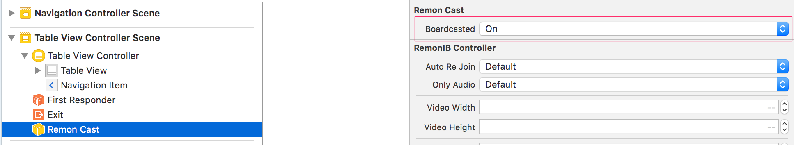

# iOS - Livecast

## 기본 설정

방송을 하기 전에 프로젝트 설정을 진행 합니다.



방송을 만드는 경우에는 `broadcast` 값을 `on`으로 시청인 경우에는 `off`로 설정 합니다.



`broadcast` 값을 아래와 같이 코드상으로도 설정할 수 있습니다.

```swift
remonCast.broadcast = true
remonCast.createRoom()
```

```swift
let config = RemonConfig()
config.channelType = "BROADCAST"
remonCast.createRoom(config)
```

## 개발

`RemonCast` 클래스는 방송 생성 및 시청을 위한 기능을 제공합니다. `RemonCast` 클래스의 `createRoom()` 함수와 `joinRoom()` 함수를 이용하여 방송 기능을 이용 할 수 있습니다. 

`RemonIBController`에 값을 직접 설정 않고, `connectRoom()`, `createRoom()`, `joinRoom()` 함수에 `RemonConfig`를 전달 할 수도 있습니다. 이 경우에는  `RemonIBContoller` 인스턴스에 설정된 값이 무시되고 전달된 `config` 정보를 이용합니다.

### 방송생성

```swift
remonCast.createRoom()
```

혹은 아래와 같이 Interface Builder 없이 작성 가능합니다.

```swift
let caster = RemonCast()
caster.serviceId = "YourServiceID"
caster.serviceKey = "YourServiceKey"
caster.broadcast = true
caster.localView = localView
caster.createRoom()
```

### 방송시청

```swift
remonCast.joinRoom("chid")
```

혹은 아래와 같이 Interface Builder 없이 작성 가능합니다.

```swift
let watcher = RemonCast()
watcher.remoteView = remoteView
let config = RemonConfig()
config.serviceId = "YourServiceID"
config.key = "YourServiceKey"
config.channelType = "VIEWER"
caster.joinChannel(config)
```

### Observer

`Remon`은 방송 생성 및 시청 중에  상태 추적을 돕기 위한 `Observer` 함수를 제공 합니다.

```swift
remonCast.onInit {
    // UI 처리등 remon이 초기화 되었을 때 처리하여야 할 작업
}

remonCast.onComplete {
    // 방송 생성 및 시청 준비 완료
}

remonCast.onClose {
    // 방송 종료
}
```

`Remon`이 제공하는 `Observer` 함수에 대한 더 자세한 내용은 `Oserver` 가이드 문서를 참조 하세요



### Channel

방송을 시청 하기 위해서는 시청 하려는 채널이 ID가 필요 합니다. 채널 ID는 방송이 생성 될 때 마다 변경 되는 유니크 값입니다. `Remon`는 시청 하려는 채널에 쉽게 접근 할 수 있도록 돕는 검색 기능을 제공 합니다.

```swift
remonCast.search { (error, results) in
    // 채널 목록 처리
}
```

채널 검색에 대한 더  자세한 내용은 아래를 참고하세요.




