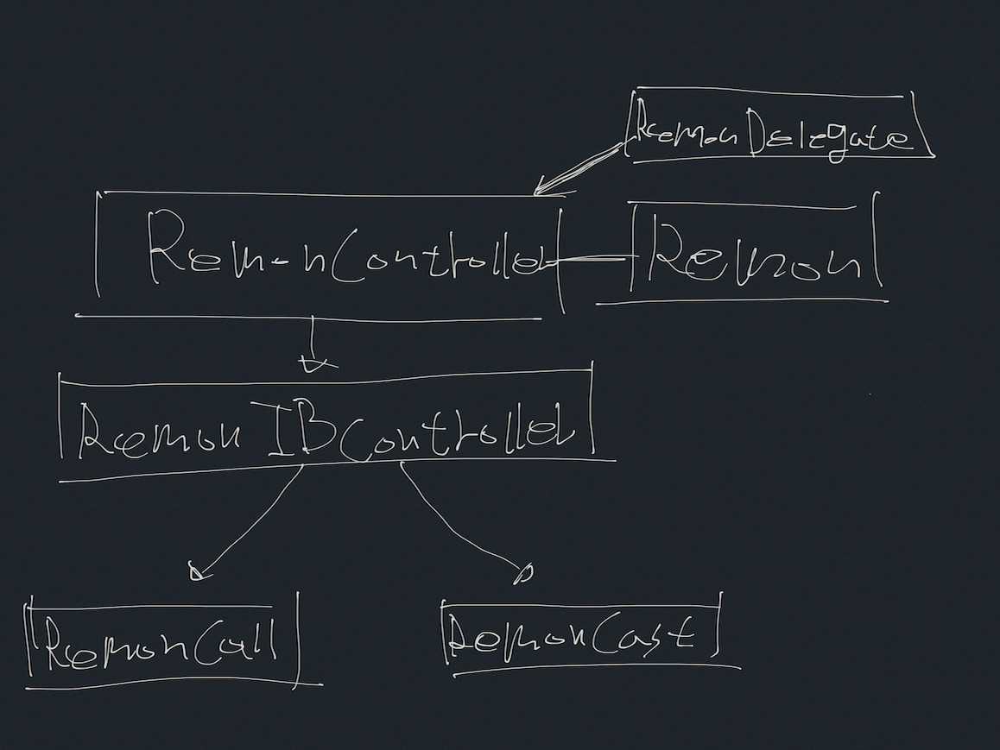

# iOS - Overview

## Overview

Remon를 클래스는 Remon SDK 에서 가장 핵심이 되는 클래스 입니다. Remon 클래스를 사용하고, RemonDelegate를 직접 구현 하여 Remon이 제공하는 통신 기능과 방송 기능을 이용 할 수도 있지만 이는 복잡하고, 따분한 작업이 될 것입니다. 그래서 SDK 사용자가 좀 더 쉽고 빠르게 Remon를 이용 할 수 있도록 복잡 하고, 반복적인 기본 작업을 포함 하고 있는 RemonController 클래스와 Interface Builder\(이하 IB\) 지원을 위한 RemonIBController 클래스를 제공 합니다. RemonController 클래스를 이용한면 복잡한 RemonDelegate의 메소드들을 구현 할 필요 없이 필요한 부분 추가 적으로 구현 하면 됩니다.

## Resources

### Downloads, Change Log, Examples



RemoteMonster iOS SDK에 대한 모든 정보를 얻을 수 있습니다. 다양한 예제를 코드로 검토하세요.

### Reference Document



SDK의 기능을 세부적으로 안내합니다.

