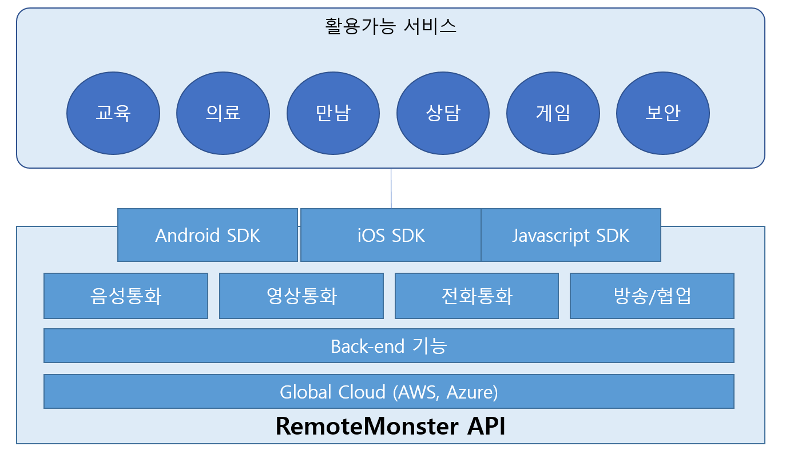

# 개요
## 리모트몬스터는?
- 리모트몬스터는 통신회사 출신의 젊은 엔지니어들이 모여 만든 새로운 세대의 통신회사입니다. 알렉산더 그레이엄 벨과 안토니오 무치가 전화기를 개발한 이후로 통신은 우리에게 없어서는 안될 산업 핵심이 되었지만 통신산업을 이루는 규제 중심, 거대기업과 폐쇄적인 정보와 기술기반의 문화는 변하지 않았습니다. 리모트몬스터는 WebRTC기술을 기반으로 이러한 기존의 통신산업과는 다른 방식으로 통신산업에 작지만 새로운 바람을 일으켜보고자 합니다.

## 비전

- 리모트몬스터가 추구하는 비전입니다. 리모트몬스터는 새로운 세대의 통신 서비스를 추구합니다.

## 가치
### Open technology
- 리모트몬스터의 모든 구현 기술은 철저히 표준과 오픈 기술을 기반으로 하고 있으며 항상 보유한 기술의 공유와 전파를 위해 노력합니다. 우리는 통신의 모든 기술은 나누어지고 공유되었을 때 더 큰 힘을 발휘한다고 믿습니다. 리모트몬스터가 WebRTC기술을 적극 활용하는 이유는 바로 이 점에 있습니다.
### Simple experience
- 우리의 고객이 복잡한 기능적 요소 대신에 핵심에 집중할 수 있도록 보다 편한 통신 서비스를 생각합니다.
### Cloud telecommunication
- 리모트몬스터의 모든 기술은 클라우드를 통해 제공됩니다. 우리는 통신의 모든 영역에서의 클라우드화를 꿈꾸고 있습니다. 통신은 All IP시대를 지나 All cloud의 시대로 나아가고 있습니다.

## 파트너
- 리모트몬스터는 2016년부터 기술기업 엑셀러레이터인 FuturePlay와 투자파트너십을 맺고 글로벌 사업화를 위하여 노력하고 있습니다.

## 리모트 몬스터 API
- 리모트몬스터의 모든 통신기술은 API형태로 제공됩니다. 이제 복잡한 Back-end개발과 통신기술 개발의 부담에서 해방되어 누구나 쉽게 Skype나 Hangout, 스냅챗과 같은 통신 서비스를 구현할 수 있습니다. 리모트몬스터가 구축하는 글로벌한 통신 API 백엔드와 SDK를 통해 통신회사에 준하는 자원을 즉시 확보하세요.
- 리모트몬스터 API는 다음과 같은 형태로 구성되어 있습니다.

- 핵심 기능
 - 모바일 플랫폼 지원: 이미 운영중인 서비스 혹은 개발할 서비스에 SDK를 추가하고 몇가지 소스코드를 추가하여 통신 기능을 적용합니다.
 - 실시간 통화 지원: 영상, 음성 통신 뿐 아니라 방송이나 일반전화 대상 송수신 등의 기능을 제공합니다
 - 글로벌 클라우드 환경 지원: 리모트몬스터의 기능은 글로벌 클라우드에 의해 운영되어 세계 어디에서나 빠른 통신품질을 보장합니다.

## 리모트몬스터 API를 사용해야 하는 이유
### 비용 절감
- 개발비용: 특히 앱에 적용시 많은 분들이 브라우저에서 기본 내장된 WebRTC API를 믿고 쉽게 관련 서비스를 개발하다가 낭패를 보곤 합니다. 아직 WebRTC는 모바일 스마트폰을 지원하지 않으며 이를 위해 고숙련 개발자 2명 이상의 투입이 필요합니다.
- 운영비용: 안정적인 통신 환경을 고객에게 제공하기 위해 높은 운영 비용을 감당해야 합니다. 모바일 상황에서 통신은 때때로 불안정할 수 있고 글로벌 통신시 장애 대응 방안도 마련해야합니다. 무엇보다 수없이 많은 통신 예외 상황에 대한 처리 비용은 매우 높습니다.
품질
- 세계 최고의 미디어엔진: 글로벌 수준의 미디어엔진과 코덱을 가장 최신의 버전으로 제공합니다. WebRTC의 내장엔진은 현재 가장 빨리 발전하고 있는 미디어엔진이며 RemoteMonster는 WebRTC의 미디어엔진을 가장 빨리 제공합니다.
- 글로벌 통신 안정성: 리모트몬스터의 시그널 서버 및 릴레이 서버는 모두 글로벌 Region에서 서비스되고 있기에 세계 어디에서 통화를 하든 가장 최상의 통화 품질을 제공합니다.
- 확실한 기술지원: 통신 인프라 서비스는 무엇보다 즉각적인 기술 지원이 필수입니다. 언제 어디서나 어떤 환경에서든 장애는 일어날 수 있습니다. 문제는 그것을 누가 언제 어떻게 대응하느냐 하는 것입니다. 리모트몬스터는 한국에서 가장 빠른 기술 지원 인력과 환경을 제공하고 있습니다.

### 기능
- 가장 폭넓은 모바일 플랫폼 지원: 리모트몬스터는 WebRTC가 현재 지원할 수 있는 범위를 뛰어넘어 모바일과 IoT로 그 지원 범위를 확장하고 있습니다. 크롬이나 Firefox같이 WebRTC를 지원하는 표준 브라우저뿐 아니라 네이버의 웨일과 같은 브라우저, 마이크로소프트의 Edge같은 브라우저와의 호환성도 보장합니다. 또한 안드로이드나 iOS 역시 완벽하게 네이티브로 지원합니다.
- 전화통화 지원: 리모트몬스터는 앱과 웹간의 통화뿐 아니라 전화통화 기능도 제공합니다. 즉 앱에서 일반 전화나 휴대폰으로 전화를 걸고 앱에서 전화를 받을 수도 있습니다.
모니터링 기능: 모든 통화 트랜잭션의 상태를 실시간으로 또는 통계적으로 모니터링할 수 있습니다.
- 녹화 기능: 필요하다면 통화 내용을 녹화하여 지속적으로 보관하는 것도 가능합니다. 앱 내에서 녹화하는 기능과 서비스 서버에서 녹화하는 기능등을 제공합니다.

## 특장점
### 플랫폼 지원
- 최신의 플랫폼 지원: WebRTC 엔진인 Chrominum 6개월 이내의 최신 버전을 제공하여 호환성과 성능 및 품질 최고를 경험.
- 최신의 표준 지원: WebRTC 1.0을 가장 빠르게 지원(WebRTC 1.0 CR 기준)
- 가장 다양한 플랫폼 및 최신의 언어 지원: Android, iOS(Objective C, Swift 3.0), Chrome/Firefox/Edge/Whale ( promise 방식, ES6 준수), 국내환경에서 가장 많은 플렛폼 지원

### 품질
- Global 통신 인프라 지원: 국내 뿐 아니라 Global한 통신에 대한 레퍼런스 및 경험 확보
- 속도: 국내에서 가장 빠른 Setup time. 평균 1초 미만의 Setup time 보장(국내, Browser 기준)
- 품질: 모바일 기기의 성능에 따른 다양한 성능 옵션 선택 가능. 네트워크 상황에 따른 지능적인 동적 품질 적용 엔진. 다양한 코덱 선택 가능(영상: VP8, VP9, H.264, 음성: G.711, Opus(Stereo), ISAC(Mono)

### 개발 용이성
- WebRTC 체계를 만드는데 1달 가까이 걸리는 시간을 절약하고 바로 시작
- Simple한 개발 방식: 3 line(JS), 10 line(Android)
- Config → Connect 2단계로 개발하는 가장 쉬운 ᅟWebRTC 코드

### 세부 기능표

### 활용 고객

## 적용 가능 서비스
- 영어회화, 공부방, 교육 서비스
- 뷰티 서비스
- 운세 서비스
- 상담 서비스
- IoT 등 기기연동 서비스
- O2O, 옴니채널 서비스
