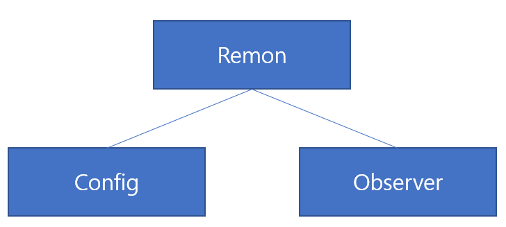

# 개발 순서
RemoteMonster API의 SDK를 이용하여 개발하는 순서는 크게 다음과 같습니다.

1. 서비스 등록 및 인증키 획득
 - 리모트몬스터 홈페이지에서 여러분의 서비스 개발을 위한 등록을 마칩니다. 리모트몬스터는 메일을 통해 인증키를 발급합니다.
 - 인증키는 2개로 구성됩니다. 테스트키는 개발용이며 운영용은 운영시 사용하게 됩니다. 키가 분리된 이유는 과금과 관리를 위해서입니다. 테스트키는 과금내역에 들어가지 않습니다. 테스트키는 안정성과 품질을 보장하지는 않습니다.
2. 개발 환경 설정 및 SDK 다운로드
 - 리모트몬스터 API의 SDK는 모두 별도의 SDK 저장소로부터 자동으로 다운로드받을 수 있습니다. 안드로이드는 메이븐 레파지토리 방식을 따르므로 Gradle 빌드 파일에서 손쉽게 설정만으로 최신 버전을 다운로드 받을 수 있고 Javascript SDK는 NPM 레파지토리를 통해서 제공하므로 npm 명령을 통해 다운로드할 수 있습니다.
 - iOS는 xcode, 안드로이드는 Android Studio, Javascript는 NPM환경을 기본적으로 제공합니다.
 - https://github.com/RemoteMonster 에서 자신에게 맞는 예제를 다운로드받아서 개발하면 빠르게 개발이 가능합니다.
3. 개발
 - 개발에 필요한 예제와 문서와 함께 어려운 점은 [리모트몬스터 게시판](http://community.remotemonster.com/)을 활용합니다. 2-3시간 안에 질문에 대한 답을 얻을 수 있습니다.
4. 운영
 - 서비스 개발이 끝나면 상용 버전의 서비스 시작 전 리모트몬스터에 통보합니다. 리모트몬스터는 보다 나은 품질과 안정성을 제공하기 위한 서버세팅과 관리자 화면을 제공합니다.
 - 테스트용키가 아니라 운영 키를 사용하여 보안과 품질을 높이세요.
5. 관리
 - 리모트몬스터는 상용 서비스에 한하여 별도의 관리자 화면을 제공하여 트래픽 정보와 통화 품질에 대한 정보를 실시간으로 제공합니다.
 - 이를 통해 어떤 고객에게 주로 문제가 발생하는지, 어떻게 개선하면 좋을지 점검할 수 있습니다.

# 핵심 클래스
- 리모트몬스터 API의 SDK를 사용하는 것은 매우 간단합니다. 크게 3가지의 클래스 사용법만 익히면 됩니다.

## Remon class
- Remon에서 모든 방송, 통신관련 조작을 수행합니다. 방송, 통신상태를 초기화하고 방을 개설하고 방에 접속하고 종료하는 일련의 모든 과정에서 이 Remon 클래스를 사용합니다.
- 주요 기능
 - Init: 객체를 초기화하는 과정입니다. 이를 통해 RemoteMonster API 서버와 연결됩니다. 연결되는 순간 RemoteMonster 서버는 이 Remon 객체에게 1회용 토큰을 제공합니다.
 - Connect: 통신에 사용하는 기능입니다. 방에 접속하거나 방을 만드는 명령입니다. 주어진 이름의 방이 없을 경우 방을 만들고 이미 방이 있을 경우 방에 접속합니다. 물론 사전에 방 이름이 있어야 하겠지만 만약 방 이름이 없을 경우 RemoteMonster는 고유한 방 이름을 생성해서 반환합니다.
 - CreateRoom, JoinRoom: 방송에 사용하는 기능입니다. 방송용 방을 만들거나 시청하는 명령입니다. 방을 만들 때에는 방의 닉네임을 전달할 수 있고 Observer등의 콜백을 통해 onCreate에서 방의 실제 유일한 id값을 받게 되며 이 id값을 이용하여 JoinRoom 메소드를 통해 시청자는 해당 방에 접근할 수 있습니다.
 - Search: 주어진 인자값에 해당하는 방이름이 있는지 검색하여 알려줍니다. 인자값이 없으면 모든 방 정보를 알려줍니다.
 - sendMessage: 상대편에게 문자형태의 메시지를 보낼 수 있습니다. 이 기능을 통해 다양한 작업을 수행할 수 있습니다. 주로 통신 기능에서만 사용이 가능합니다.
 - Close: 방을 나오거나 방을 없애버리고 초기화합니다.
- Remon 클래스를 생성하기 위해서는 2개의 미리 준비된 정보가 필요합니다. 그것이 바로 위의 그림에서 보듯 Config와 Observer입니다.

## Config Class
- Remon 객체를 초기화하기 전에 필요한 사전 설정작업은 모두 이 Config를 통해서 이루어집니다. 다음과 같이 구성되어 있습니다.
- Credential: 인증과 관련된 정보를 처리합니다.
 - key: 리모트몬스터로부터 받은 인증키를 입력합니다. 리모트몬스터는 2개의 인증키를 발급합니다. 테스트용키는 개발중에 사용하시면 되며, 상용키는 별도로 리모트몬스터와 협의 후 사용하시면 됩니다.
 - serviceId: 여러분이 누구인지를 처음에 가입했을 때 입력하신 unique한 id를 입력하면 리모트몬스터는 이 정보를 바탕으로 인증을 수행합니다.
- Media: 영상과 음성에 대한 여러가지 설정을 할 수 있습니다.
 - 영상 사용여부: 음성 통화만을 원한다면 영상은 false로 하고 사용하면 아까운 통신요금과 Bandwidth를 줄일 수 있겠죠.
 - 코덱 선택: 음성과 영상 모두에 대해 코덱을 선택할 수 있습니다. 영상의 경우 리모트몬스터는 기본적으로 H.264를 사용하고 있으며 음성은 OPUS를 사용합니다.
 - FrameRate와 해상도: 영상의 경우 해상도와 FrameRate을 수정하여 원하는 품질을 적용할 수 있습니다.
 - 녹음여부: 리모트몬스터는 녹음기능을 기본 제공합니다. 증거가 필요한 서비스의 경우 녹음기능을 켜두면 안심입니다.
 - 기타: 그 외에도 다양한 카메라, 마이크, 스피커에 대한 처리가 가능합니다.
- 기타 개발관련 설정
 - 로그: 로그 수준을 조절하여 개발시에 유용하게 사용할 수 있습니다.

## Observer Class
- Remon 클래스가 명령을 내리는 용도라면 Observer(Javascript SDK에서는 Listener, iOS에서는 Delegetor)는 Callback 메시지를 수신하기 위한 클래스입니다. Observer로부터 수신되는 이벤트를 이용하여 보다 세밀한 통신효과와 능동적인 서비스를 구현할 수 있습니다. 다음과 같은 메소드가 호출됩니다.
- onStateChange: 최초 Remon객체를 만들고 방을 만들며 접속하고 접속에 성공하고 방송, 통신을 마칠 때까지의 모든 상태 변화에 대해 처리하는 메소드입니다. RemonState enum객체를 통해 어떤 상태로 변경되었는지를 알려줍니다. RemonState의 상태는 다음과 같습니다.
    - INIT(시작), WAIT(방 생성), CONNECT(방 접속), COMPLETE(통신 연결완료), FAIL(실패), CLOSE(종료)
- onError: 통신 시도 중 장애 발생시 호출됩니다.
- onAddLocalStream: 자기 자신의 카메라의 영상이 혹은 음성 스트림을 획득하였을 경우 호출됩니다.
- onAddRemoteStream: 상대방의 영상이나 음성 스트림을 획득하였을 경우 호출됩니다. 연결이 되었다는 뜻이죠.
- onInit: Remon객체가 무사히(?) 생성되었을 경우 불려집니다. 이 onInit메소드가 불려지고 바로 Remon.connectchannel 메소드를 수행할 수 있습니다.
- onSearch: Remon.search 메소드를 호출하면 Observer의 onSearch메소드가 결과를 반환합니다.
- onMessage: Remon.sendMessage 메소드를 호출하면 Observer의 onMessage메소드가 결과를 반환합니다.
