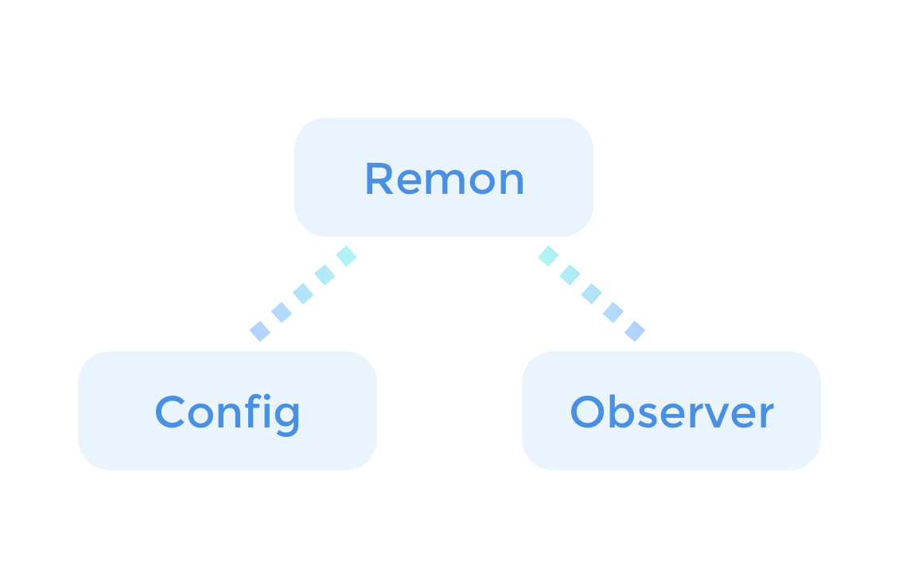

# Structure

## Overview

RemoteMonster의 SDK를 사용하는 것은 매우 간단합니다. 크게 3가지의 클래스 사용법만 익히면 됩니다.

## Remon class

Remon에서 모든 방송, 통신관련 조작을 수행합니다. 방송, 통신상태를 초기화하고 방을 개설하고 방에 접속하고 종료하는 일련의 모든 과정에서 이 `Remon` 클래스를 사용합니다. 또한, 메세지 보내기와 같은 추가적인 기능을 수행합니다.

`Remon` 클래스를 생성하기 위해서는 2개의 미리 준비된 정보가 필요합니다. 다음에 설명될 `Config`와 `Observer`입니다.

### Init

객체를 초기화하는 과정입니다. 이를 통해 RemoteMonster API 서버와 연결됩니다. 연결되는 순간 RemoteMonster 서버는 이 `Remon` 객체에게 1회용 토큰을 제공합니다.

### Create, Join

방송에 사용하는 기능입니다. 방송을 만들거나 시청하는 명령입니다. 방송을 만들 때에는 `Observer` 콜백을 통해 `onCreate`에서 방송의 실제 유일한 id값을 받게 되며 이 id값을 이용하여 `Join` 메소드를 통해 시청자는 해당 방송에 접근할 수 있습니다.

### Connect

통신에 사용하는 기능입니다. 채널에 접속하거나 채널을 만드는 명령입니다. 주어진 이름의채널이 없을 경우 채널을 만들고 이미 채널이 있을 경우 채널에 접속합니다. 만약 채널 이름이 없을 경우 RemoteMonster는 고유한 채널 이름을 생성해서 반환합니다.

### Close

방을 나오거나 방을 없애버리고 초기화합니다.

### 사용법





## Config Class

`Remon` 객체를 초기화하기 전에 필요한 사전 설정작업은 모두 이 `Config`를 통해서 이루어집니다. Service Id, Key와 같은 인증정보와 미디어, 네트워크와 관련된 다양한 작업을 처리 합니다. 보다 세부적인 내용은 아래를 참고하세요.



## Observer Class

`Remon` 클래스가 명령을 내리는 용도라면 `Observer`는 Callback 메시지를 수신하기 위한 클래스입니다. `Observer`로부터 수신되는 이벤트를 이용하여 보다 세밀한 통신효과와 능동적인 서비스를 구현할 수 있습니다. 자세한 내용은 아래를 참고하세요.



